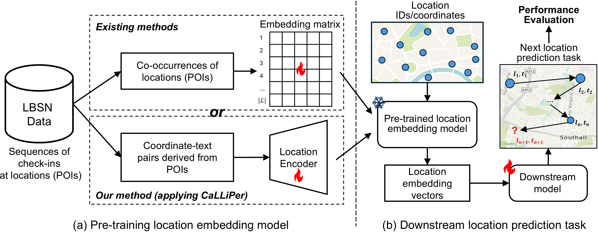

# Into-the-Unknown
Welcome! This is the repository for our paper -- **_Into the Unknown: Applying Inductive Spatial-Semantic Location Embeddings for Predicting Individuals’ Mobility Beyond Visited Places_**. 

## Table of Contents

- [Data](#data)
- [Executing the *"pre-train -> apply in downstream task"* Pipeline](#executing-the-pre-train---apply-in-downstream-task-pipeline)
  - [1. Pre-training Location Embeddings](#1-pre-training-location-embeddings)
    - [1.1 Baseline Methods](#11-baseline-methods)
    - [1.2 CaLLiPer](#12-calliper)
  - [2. Next Location Prediction (Downstream Task)](#2-next-location-prediction-downstream-task)
- [Reproducing Results on FSQ-NYC](#reproducing-results-on-fsq-nyc)
- [Acknowledgements](#acknowledgements)

## Data

Currently, only the FSQ-NYC data is included. More will be added in the future.

The raw Foursquare check-ins data can be downloaded from [Dingqi Yang's Homepage](https://sites.google.com/site/yangdingqi/home/foursquare-dataset). The preprocessing steps of the raw data are introduced in the [MHSA repository](https://github.com/mie-lab/location-prediction). For convenience, we directly include the preprocessed data along with the train, validation, and test sets in `./data` folder.

Note that 

- The script in `data/fsq_nyc/fsq_nyc_process.ipynb` contains the code for constructing train, validation and test sets under the *Inductive* setting (as described in Section 4.3 of the paper). 

- The file `data/fsq_nyc/fsq_nyc_pois.csv` contains the training data used for *CaLLiPer*. This poi data is extracted from the original Foursquare NYC dataset.

## Executing the *"pre-train -> apply in downstream task"* pipeline

The whole framework consists of two main stages: 
1. pre-training location embeddings 

2. Applying pre-trained embeddings in downstream tasks



### 1. Pre-training location embeddings

####  1.1 Baseline methods
Specifiy the parameters in the configuration file: `configs/{dataset_name}/pretrain_{city_name}_{model}.yaml`. For example, the config file for pre-training *POI2Vec* on *FSQ-NYC* is `configs/fsq_nyc/pretrain_nyc_poi2vec.yaml`.

And then run the following command to start the pre-training.
```bash
python run_pretrain.py --config {path_to_config_file}.yaml
```
The pre-training results will be saved in the `./pretrained` directory, including the `embed_mat` file and a log file.

The folder name for the results depends on the `inductive_pct` parameter:
- If `inductive_pct = 0`, results will be saved as `{dataset_name}_{method_name}_{time}/` 
- If `inductive_pct = 10` (10% of the locations sampled to form $\mathcal{L}^{new}$), the folder will be `{dataset_name}_{method_name}_inductive10pct_{time}/`

#### 1.2 CaLLiPer

To pre-train using CaLLiPer, use the POI coordinate-description pairs `data/fsq_nyc/fsq_nyc_pois.csv`. 

Refer to the original [CaLLiPer Repo](https://github.com/xlwang233/CaLLiPer) for detailed instructions.

We recommend running CaLLiPer pre-training separately by cloning the original repository, placing the training data there, and then copying or moving the resulting checkpoint into this project’s `./pretrained` folder.

### 2. Next location prediction (downstream task)

After obtaining the pre-trained location embeddings, configure the parameters in `configs/{dataset_name}/next_loc_pred.yml` and run the following command: 

```bash
python main.py --config configs/{dataset_name}/next_loc_pred.yml
```

Key parameters inside the config file:

- `loc_embed_method`: the specific pre-training method used
- `loc_enc_ckpt_path`: the path to the **saved** location embedding results. 
- `inductive_pct`: Set it to 0 (conventional) or 10 (inductive) to switch task settings. 

The downstream results will be saved in either `./outputs_conventional` or `./outputs_inductive`.

## Reproducing results on FSQ-NYC

We provided some pre-trained location embeddings in `./pretrained`, which can be used to reproduce the results in Table 2 of the paper. 

To do so, just specify the parameters `loc_embed_method`, `loc_enc_ckpt_path`, `inductive_pct`, in the config file `./configs/fsq_nyc/next_loc_pred.yml` and run the command as described above.

For now, only the experiments on the FSQ-NYC dataset are supported, but we plan to facilitate more datasets in the future.

## Acknowledgements
This project builds on the excellent work from: [CTLE](https://github.com/Logan-Lin/CTLE), [CaLLiPer](https://github.com/xlwang233/CaLLiPer), and [location-prediction](https://github.com/mie-lab/location-prediction).

We thank the authors for their inspiring work and for promoting open and reproducible research!